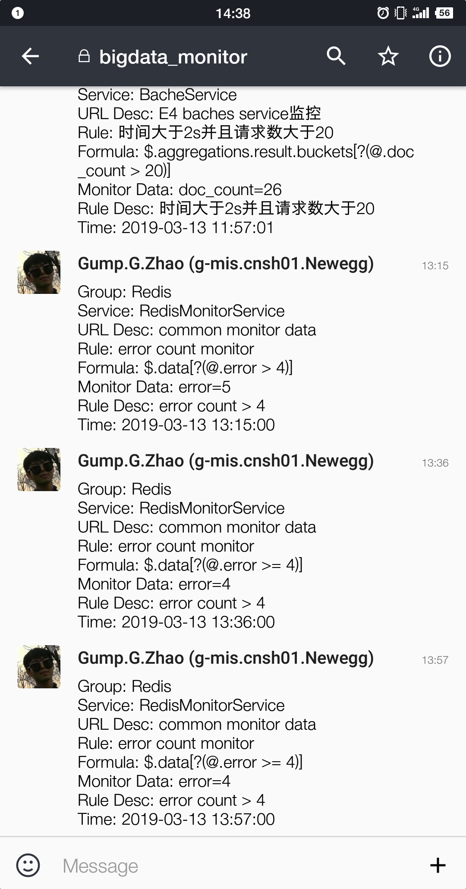

# Service Alarm Platform 使用教程
> 通过该平台接入 Service 、GateWay 等服务或平台暴露的监控接口，通过配置监控规则和通知方式，可近实时地监控服务状态。

## 首页
> Github:  <a href="https://github.com/ngbdf/service-alarm-platform" target="_blank">Service Alarm Platform</a>

## 微信报警&RocketChat报警
<html>
  <table style="margin-left: auto; margin-right: auto;">
    <tr>
      <td>
        
      </td>
      <td>
        
      </td>
    </tr>
  </table>
</html>

## 项目架构

## 项目数据库关系

## 添加组
> **GroupName**: 组名  
> **Description**: 组介绍

## 添加 Service
> **GroupName**: 组名（不可更改）  
> **Service Name**: 服务名称  
> **Description**: 服务描述  
> **Alarm Way**: 报警方式，默认提供微信和 RocketChat 报警方式

## 添加 URL
> 填写完Service信息后，点击跳转到URL管理页面，根据暴露的接口填入相应的数据，点击 ``TEST`` 按钮对填入的URL及参数进行校验，校验通过后点击 ``SAVE`` 按钮。

## 添加 Rule
> 填写完URL信息后，点击跳转到Rule管理页面，点击 ``REQUEST`` 按钮，显示监控数据
> Alias: 规则别名
> Formula: 监控规则，点击监控数据中所要监控的数据的 ``Key``，则会自动生成规则，如果需要调整，可自行编辑
> Description: 规则描述

